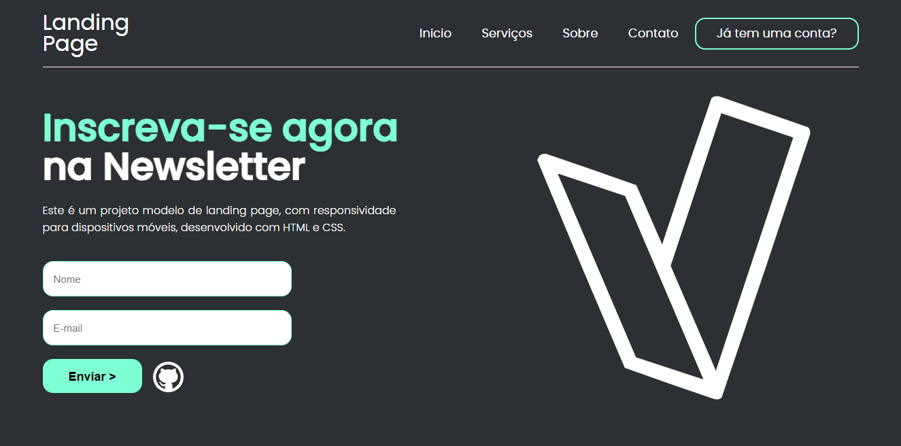

<h1 align="center">Landing Page</h1>

## 💻 Sobre o projeto:
Esse projeto de landing page é responsivo para dispositivos móveis e foi desenvolvido apenas com HTML e CSS.
 
O objetivo do projeto é criar um modelo de landing page com um design moderno e simples que pode ser adaptado de acordo com o tema escolhido.
  

## 🖌️ Layout:
 

 

## 🛠 Tecnologias:
As seguintes tecnologias foram usadas no desenvolvimento do projeto:

  
  

 

## 💡 Como acessar o projeto:
#### Para acessar basta clicar no link a seguir: https://emmanuelly-silva.github.io/Landing-page/.
 

## 📝 Autora:
⚡ *Emmanuelly Lavínia da Silva*

